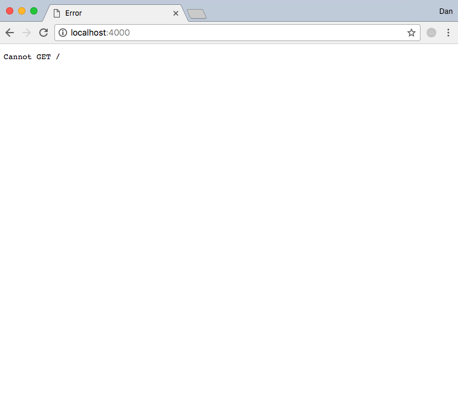
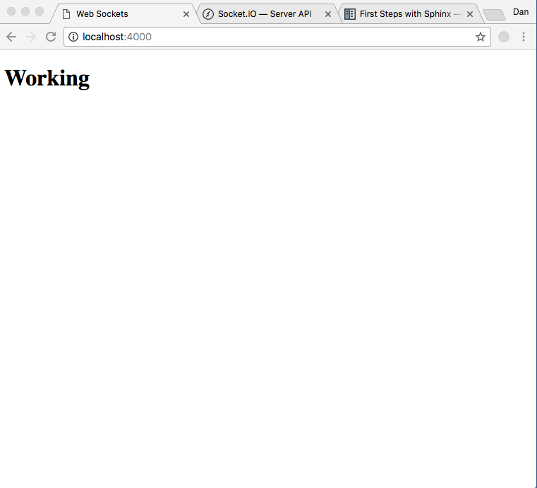
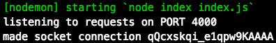
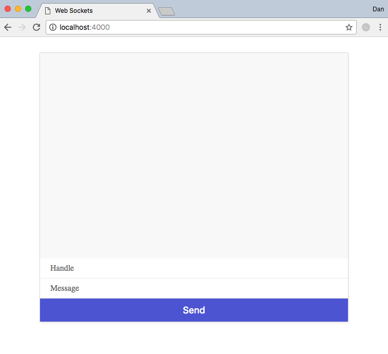
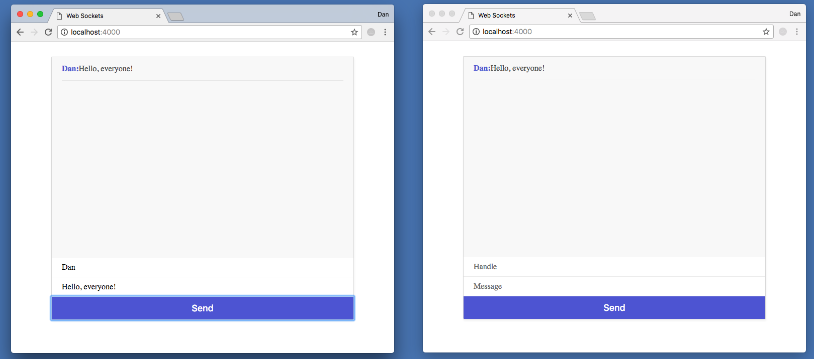

# App-building guide

### Follow github versions

Based upon Net Ninja web sockets Tutorial

This app uses websockets.io library to communicate between the client and browser.

The server-side code will be run on node.js in an Express app.

Made a github repository with a node `.gitignore` (hides the node_modules folder) and cloned repository to local machine

#### v0.1
Initialize the project in the local folder with the terminal command `npm init`.
- This installs a package.json file, (accept all prompts)

Install two dependencies
- `npm install express --save`
- `npm install nodemon --save-dev`

nodemon is for convenience
- restarts server automatically as we change our server-side code... activated later with `nodemon index`

Create new file `index.js`

```javascript
var express = require('express');

// App setup by invoking 'express' function
var app = express();

// Setup server as a variable to listen on a portal
// Add function to let us know its listening
var server = app.listen(4000, function () {
  console.log('listening to requests on PORT 4000');
});
```

In app_directory, terminal run nodemon for first time with
`nodemon index`


```
$ nodemon index
[nodemon] 1.12.1
[nodemon] to restart at any time, enter `rs`
[nodemon] watching: *.*
[nodemon] starting `node index index.js`
listening to requests on PORT 4000
```

At the moment, localhost:4000 displays a blank page


We need to use some 'middleware' to 'serve' some static/public files.

Add to `index.js`

```javascript
// Static files
app.use(express.static('public'));
```

Make a new folder in websocket_app called 'public' and add an `index.html` and `styles.css` file

Anytime the app 'looks' for a static file (html or css) it will search in the public folder and serve it up (if found).

Add this code to `index.html`
```html
<!DOCTYPE html>
<html>
    <head>
        <meta charset="utf-8">
        <title>WebScockets 101</title>
        <link href="/styles.css" rel="stylesheet" />
    </head>
    <body>
        <h1>Woo, you see me!</h1>
    </body>
</html>
```
Add this code to `styles.css`
```css
body{
    font-family: 'Nunito';
}

h2{
    font-size: 18px;
    padding: 10px 20px;
    color: #575ed8;
}

#mario-chat{
    max-width: 600px;
    margin: 30px auto;
    border: 1px solid #ddd;
    box-shadow: 1px 3px 5px rgba(0,0,0,0.05);
    border-radius: 2px;
}

#chat-window{
    height: 400px;
    overflow: auto;
    background: #f9f9f9;
}

#output p{
    padding: 14px 0px;
    margin: 0 20px;
    border-bottom: 1px solid #e9e9e9;
    color: #555;
}

#feedback p{
    color: #aaa;
    padding: 14px 0px;
    margin: 0 20px;
}

#output strong{
    color: #575ed8;
}

label{
    box-sizing: border-box;
    display: block;
    padding: 10px 20px;
}

input{
    padding: 10px 20px;
    box-sizing: border-box;
    background: #eee;
    border: 0;
    display: block;
    width: 100%;
    background: #fff;
    border-bottom: 1px solid #eee;
    font-family: Nunito;
    font-size: 16px;
}

button{
    background: #575ed8;
    color: #fff;
    font-size: 18px;
    border: 0;
    padding: 12px 0;
    width: 100%;
    border-radius: 0 0 2px 2px;
}
```

The web page will still look plain until we add html elements that fit the css styling.


#### v0.2
Now we will start usingweb sockets via the library socket.io
Will be installed server-side (`index.js`) and client-side (`index.html`). This allows socket.io to be set up on both sides and allow data to pass between the two ends.

In the `node.js` file store the socket function in a variable. socket() takes one argument... the server we declared. Socket.io will now be on the server waiting for client/browser to setup a websocket.

```javascript
// Socket setup
var io = socket(server);
```

We now need to detect the 'connection' event which subsequently fires a callback function once the connection is made. The callback function takes the argument `socket` for the specific instance from which the socket was made. Therefore, each client will have its own socket instance which can be viewed by passing socket.id argument.
```javascript
io.on('connection', function(socket){
  console.log('made socket connection', socket.id)
})
```
Load socket.io library onto front end.
From https://cdnjs.com/libraries/socket.io copy the most recent `...socket.io.js` cdn library and paste into `index.html`
```html
<script>https://cdnjs.cloudflare.com/ajax/libs/socket.io/2.0.4/socket.io.js</script>
```

Need to create own `.js` file where we will run all our custom socket code. Reference this in html with
```html
<script src="/chat.js"></script>
```

Now let's create  the contents of the `chat.js` file in public folder

Now we should create the `chat.js` code for making the connection between client and server

We have already loaded in the websocket.io cdn library contained within `index.html` and as a result we have access to `io` variable. So, we can make a new socket variable (not to be confused with the server-side socket variable) that connects to the local host.

```javascript
// Make connection
var socket = io.connect('http://localhost:4000');
```
Refresh the browser to check if the websocket connection was made and look at the terminal for the answer contained in our `index.js console.log` statement...

It should look like this!



So..., just what exactly happened?

Firstly, on server via `index.js`
1. We created a server, stored in in a variable
2. Invoked socket function and passed in the server
3. Then started listening for a connection with the io.on function

On client via `index.html`
4. the `index.html` file gets loaded into browser
5. browser loads in the socket.io cdn library
6. then runs `chat.js` file
7. the `chat.js` file establishes the connection to server to create the websocket

Back in `index.js`
8. We detect a connection in via the `io.on` function
9. which in turn, pushes our `console.log` message 'made socket connection'

#### v0.3
We can now start sending messages back and forth to server and clients via the websockets.

We need to add some html to design the front end of the app.

Importantly, there are four elements with id's
1. `output` (where messages are displayed)
2. `handle` (a text box taking in the name of a user)
3. `message` (a text box taking in the message typed in)
4. `send` (a button to signal transfer of a message)

```html
<div id="porkpy-chat">
  <div id="chat-window">
    <div id="output"></div>
  </div>
  <input id="handle" type="text" placeholder="Handle"/>
  <input id="message" type="text" placeholder="Message"/>
  <button id="send">Send</button>
</div>
```
Refreshing the browser... things should look like this


Start querying the DOM and storing some variables. These variables are references to Handle, Message, Send and Output from the browser.
A variable is created for each in `chat.js` so that we can do things with the variables.
```javascript
// Query DOM
var message = document.getElementById('message');
var handle = document.getElementById('handle')
var btn = document.getElementById('send');
var output = document.getElementById('output');
```

We wish to `emit` a message when someone clicks `send`. So we need to add the following functionality to a button click in the `chat.js` file.
```javascript
btn.addEventListener('click', function(){
  socket.emit('chat', {
    message: message.value,
    handle: handle.value
  })
});
```
The button element listens for a click and emits a message down the websocket to the server. The emit() function takes two parameters 1. the name of message 2. a data object which contains two values {handle, message} that we are sending to the server.
This emitted data now has to be dealt with on server by the `index.js` code.

Remember me?
```javascript
io.on('connection', function(socket){
  console.log('made socket connection', socket.id)
})
```
I was the function inside of the `index.js` file that sat on the server waiting for a connection. Well, now I can be modified to to listen for the message emitted from the client upon the establishment of a connection. As the server listens for 'chat' message, a connection is made thereby making a `socket`.

socket.on is triggered upon receipt of an emission from the browser emitted message labelled 'chat'. Upon receipt, a function is fired that accepts the 'chat' label as an argument and then passes the incoming data associated with 'chat' back out of the server to all the other connected sockets.
```javascript
socket.on('chat', function(data) {
  io.sockets.emit('chat', data)
});
```
The full function now looks like this!
```javascript
io.on('connection', function(socket){
  console.log('made socket connection', socket.id);
  socket.on('chat', function(data) {
    io.sockets.emit('chat', data)
  });
});
```
The data passed from the server, down all individual server-client sockets, now has to be accepted on the client side by code in `chat.js`!

The client is listening for events. If the socket receives a chat message it fires a callback function with the chat data and sends it to the DOM, namely to the div named 'output'

The following code is added to `chat.js` to perform this function.
```javascript
socket.on('chat', function (data) {
  output.innerHTML += '<p><strong>' + data.handle + ':</strong>' + data.message + '</p>';
});
```
The communication from two clients over a local host server can now be tested by opening two web pages and communicating from one to the other by typing in a handle and chat on one page and seeing it appear on both clients (shown below).



#### v0.4
As can be seen from the above figure, the message that I send is not only displayed in other clients browsers, but also (rather unnecessarily) it is also displayed in my own browser. When we 'broadcast' a message we can prevent the message from posting to our own browser. We can also emit a '<user> is typing' message to the other clients as a user types.

Firstly, in the `index,html` file, we add a place for the 'user is typing' message to be outputted to the screen.
```html
<div id="feedback"></div>
```
The feedback handle can then be used by `chat.js` by adding the variable...

```javascript
var feedback = document.getElementById('feedback');
```
Next, we need to add a key-press listener to the message box (where folk type their messages) which in turn emits to the server and broadcasts the 'user is typing message. So we add a listener to our message field in the front end `chat.js.`

```javascript
// listens for keypress, produces a 'typing'-labelled emission + handle's value.
// This has to now be dealt with in index.js in server for broadcasting.
message.addEventListener('keypress', function () {
  // handle.value is the data in 'typing'
  socket.emit('typing', handle.value);
});
```

This has to be handled now on the server by `index.js`.
```javascript
// Handle incoming 'typing' message.. 'broadcast' excludes own.
// Now needs to be handled by all front end clients in chat.js
socket.on('typing', function (data) {
  socket.broadcast.emit('typing', data);
  });
```

So... back to the front-end `chat.js` which receives the broadcasts with
```javascript
// receives user is typing message. Data is username
socket.on('typing', function (data) {
  feedback.innerHTML = '<p><em>' + data + ' is typing a message...</em></p>';
});
```
Finally, the following code is added to the front end `chat.js`.
```javascript
feedback.innerHTML = '';
message.value = '';
```
 It clears the feedback variable (user is typing) from the receiving clients and to clear the text from the message box in the sending client to yeild a final front end socket listener.

```javascript
socket.on('chat', function (data) {
  feedback.innerHTML = '';
  message.value = '';
  output.innerHTML += '<p><strong>' + data.handle + ':</strong>' + data.message + '</p>';
});
```

#### v0.5
Let's refactor the app into a deployable version. And deploy it. What do we need?
1. Procfile (Tells server what to do to run that app, needs a web worker). Procfile has the contents `web: node index.js` added to it

2. Check package.json is appropriate. I also had to specify node version in package.json…

  "engines": {
    "node": "6.11.1"

3. refactor listening for web portal
We need to add a web portal variable 'PORT' that allows users to connect to each other via our website. If not via the website and we wish to continue developing the app (which we will) then we will || 4000 which tells the app, if no port is found use localhost:4000.
```javascript
var PORT = process.env.PORT || 4000;
var server = app.listen(PORT, function () {
  console.log('listening to requests on ' + PORT);
});
```

4. Add an ANAME to google domains porkpy.com with the following values:

chat ANAME 15m IP-address

5. Let's deploy... I already have dokku installed previously on my server...

Log in to server:<br>
`ssh ubuntu@porkpy.com`<br>
and add the chat app:<br>
`dokku apps:create chat`<br>
list apps to check it worked:<br>
`dokku apps:list`<br>
(in local app directory):<br>
`git remote add dokku dokku@‘IP’:chat`<br>
`git remote -v`<br>
`git push dokku`<br>

6. Add SSL certificate
`dokku config:set --no-restart chat DOKKU_LETSENCRYPT_EMAIL=youremail@email.com`<br>
Then:<br>
`dokku letsencrypt`

Go to your webpage and we should be up n running

#### v0.6
Give functionality to the enter key
Add draw
